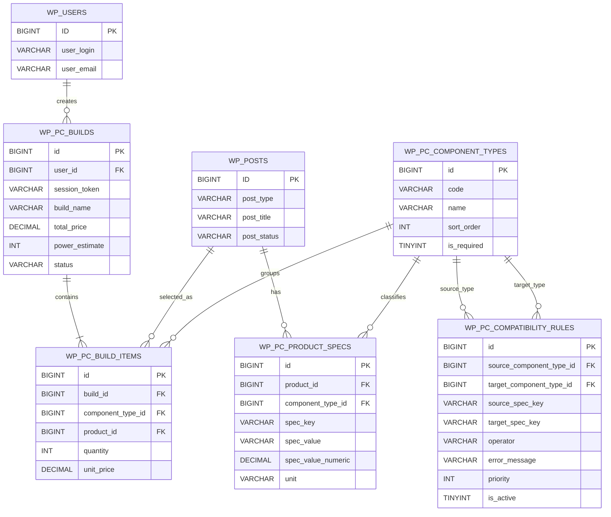

# BCCD ERD - PC Gear Store

## 1. Architecture

- Nền tảng: `WordPress + WooCommerce`
- Tùy biến giao diện: `custom theme`
- Tùy biến chức năng: `custom plugin PC Builder`
- Database: `MySQL`

## 2. Design principle

- Dùng `WordPress/WooCommerce` cho:
  - user
  - sản phẩm
  - danh mục
  - giỏ hàng
  - đơn hàng
- Dùng bảng custom cho:
  - thông số kỹ thuật linh kiện
  - cấu hình build PC
  - luật kiểm tra tương thích

## 3. Core entities

- `wp_users`
  - người dùng hệ thống
- `wp_posts`
  - sản phẩm WooCommerce (`post_type = product`)
- `wp_pc_component_types`
  - loại linh kiện: CPU, Mainboard, RAM, GPU...
- `wp_pc_product_specs`
  - thông số kỹ thuật theo từng sản phẩm
- `wp_pc_builds`
  - cấu hình PC đã lưu
- `wp_pc_build_items`
  - từng linh kiện nằm trong một cấu hình
- `wp_pc_compatibility_rules`
  - luật tương thích giữa 2 loại linh kiện

## 4. Relationship summary

- Một `user` có nhiều `build`
- Một `build` có nhiều `build_item`
- Một `build_item` tham chiếu đến một `product`
- Một `product` thuộc một `component_type`
- Một `product` có nhiều `spec`
- Một `compatibility_rule` kiểm tra giữa `source component` và `target component`

## 5. Mermaid ERD

## 6. Example compatibility rules

- `CPU.socket = Mainboard.socket`
- `RAM.ram_type = Mainboard.ram_type`
- `GPU.length <= Case.gpu_max_length`
- `PSU.watt >= Build.power_estimate`
- `Cooler.socket contains CPU.socket`

## 7. Data flow

1. Admin tạo sản phẩm bằng WooCommerce.
2. Admin nhập thông số kỹ thuật cho sản phẩm qua plugin custom.
3. User vào trang `PC Builder` và chọn linh kiện.
4. Plugin đọc `spec` của sản phẩm và so với `compatibility_rules`.
5. Nếu hợp lệ:
   - lưu cấu hình vào `wp_pc_builds`
   - lưu từng linh kiện vào `wp_pc_build_items`
6. User có thể thêm toàn bộ build vào giỏ hàng WooCommerce.

## 8. Scope note

- ERD này cố ý giữ gọn để phù hợp bài BCCĐ.
- Phần `orders`, `cart`, `payment`, `inventory` ưu tiên dùng WooCommerce core thay vì tự làm lại.
## Implementation note

Không tạo lại bảng user, product, cart, order vì các phần này dùng sẵn WordPress/WooCommerce.

Plugin custom chỉ tạo bảng:
- wp_pc_component_types
- wp_pc_product_specs
- wp_pc_builds
- wp_pc_build_items
- wp_pc_compatibility_rules